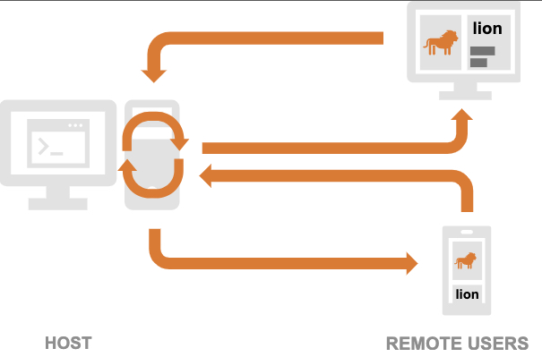

# Markdown 語法摘要
#### https://markdown.tw/
#### Markdown是一種輕量級標記式語言，創始人為約翰·格魯伯。它允許人們使用易讀易寫的純文字格式編寫文件，然後轉換成有效的XHTML文件。
#### Markdown的目標是實現「易讀易寫」。


## 標題

### Setext形式是用底線的形式，任何數量的=和-都可以有效果。

This is an H1 標題一
=============

This is an H2 標題二
-------------

### Atx形式則是在行首插入1到6個 # ，各對應到標題1到6階，例如：
# This is an H1 #

## This is an H2 ##

### This is an H3 ######

## 區塊引言

* Markdown使用email形式的區塊引言
 
> 這是區塊引言
> 這是第二行
> 第三行
> > 區塊引言可以有階層（例如：引言內的引言），只要根據層數加上不同數量的>

## 清單

> Markdown支援有序清單和無序清單。

> 無序清單使用星號、加號或是減號作為清單標記：

*   Red
+   Green
-   Blue

>有序清單則使用數字接著一個英文句點：(在清單標記上使用的數字並不會影響輸出的HTML結果)
3. 第一
2. 第二
5. 第三

>若使用**「階層式」的項目符號/編號**，只要記得空的格數要整齊即可。
+ 益者三友
  + 友直
  + 友諒
  + 友多聞
     + 益矣
+ 損者三友
  + 友便辟
  + 友善柔
  + 友便佞
     + 損矣

>要讓清單看起來更漂亮，你可以把內容用固定的縮排整理好：
*   Lorem ipsum dolor sit amet, consectetuer adipiscing elit.
    Aliquam hendrerit mi posuere lectus. Vestibulum enim wisi,
    viverra nec, fringilla in, laoreet vitae, risus.
*   Donec sit amet nisl. Aliquam semper ipsum sit amet velit.
    Suspendisse id sem consectetuer libero luctus adipiscing.

>清單項目可以包含多個段落，每個項目下的段落都必須縮排4個空白或是一個tab：
1.  This is a list item with two paragraphs. Lorem ipsum dolor
    sit amet, consectetuer adipiscing elit. Aliquam hendrerit
    mi posuere lectus.

    Vestibulum enim wisi, viverra nec, fringilla in, laoreet
    vitae, risus. Donec sit amet nisl. Aliquam semper ipsum
    sit amet velit.

2.  Suspendisse id sem consectetuer libero luctus adipiscing.


>如果要在清單項目內放進引言，那>就需要縮排：
*   A list item with a blockquote:

    > This is a blockquote
    > inside a list item.


## 代辦事項
>代辦事項的語法如下，若要在框框中打勾，則需在 [ ] 中輸入 x。
- [ ] 高鐵
- [x] 火車
- [x] 捷運
- [ ] 公車


## 程式碼區塊
>縮排4個空白或是1個tab就可以
This is a normal paragraph:

    This is a code block.
    
## 程式碼段落
Use the \`printf()\` function.

Use the `printf()` function.

>如果要放程式碼區塊的話，該區塊就需要縮排兩次，也就是8個空白或是兩個tab：
*   A list item with a code block:

        <code goes here>

> 也是程式碼區塊

* 用\`\`\`將code前後包夾。

```
function test() {
  console.log("notice the blank line before this function?");
}
```

> 程式碼語法高亮

* 起頭用\`\`\` python，可替換成ruby python C++等等 
* * https://docs.github.com/en/get-started/writing-on-github/working-with-advanced-formatting/creating-and-highlighting-code-blocks

`python`
```python
import numpy as np 
data = np.arange(6).reshape((3, 2))
print(np.average(data, axis=1, keepdims=True))
```
`Shell`
```ShellSession
sudo apt update
sudo apt install python3-dev python3-pip python3-venv
```

## 分隔線
    * * *

    ***

    *****

    - - -

    ---------------------------------------
* * *

***

*****

- - -

---------------------------------------


## 表格

>表格的每欄寬度會自動分配，所以可以忽略一切的空格(也就是每列的 | 沒有對齊也沒關係，且加多少空格也不會影響每欄的寬度)

| Column 1 | Column 2 | Column 3 |
| -------- | -------- | -------- |
| Text1 | Text2 | Text3 |
| Text4    | Text5    | Text6    |


| 預設對齊 | 靠左對齊 | 靠右對齊 | 置中對齊 |
| ----- | :----- | -----: | :-----: |
| Text1 | Text2 | Text3 | Text4 |
| Text5 | Text6 | Text7 | Text8 |
| Text9 | Text10 | Text11 | Text12 |


## 強調
    *single asterisks*
        _single underscores_
            **double asterisks**
                __double underscores__
*single asterisks*

_single underscores_

**double asterisks**

__double underscores__


## 圖片

\!\[Alt text](flow_sample_001.jpg "Optional title")



* github md 預設的[]()不能設定尺寸與對齊，僅能用html設定影像尺寸與對齊位置
* ``
* 
 不能設定尺寸與對齊
 
  
 * 設定影像大小 width="500" height="150" ，此處center無作用。
 * ``
  
   
 *  設定對齊中央 width=40% height=40% 
 *  `<p align="center">  </p>`
  <p align="center">
    
  </p>
 
  
  
## 文字色彩
>這在jupyter notebook可行，但在github仍不支援色彩文字。

```Html
<span style="color:blue"> *Blue Italic.* </span>

<font color='red'> Red HTML </font>

<font color=#FF0000>紅色</font>

<font color=#0000FF>深藍色</font>
```
<span style="color:blue"> *Blue Italic.* </span>

<font color='red'> Red HTML </font>

<font color=#FF0000>紅色</font>

<font color=#0000FF>深藍色</font>

>在github上顯示顏色的其他方法
>https://stackoverflow.com/questions/11509830/how-to-add-color-to-githubs-readme-md-file


```diff
- text in red
+ text in green
! text in orange
# text in gray
@@ text in purple (and bold)@@
```

> 支援LaTeX：2022 年 5 月起，Github 可以接受Markdown 上的 LATEX 代碼，因此您可以使用\color{namecolor} inside the $ $ Block，
> https://github.blog/2022-05-19-math-support-in-markdown/

## $\color{#0fb503}{your-text-here}$

$${\color{red}Red}$$

${\color{red}Red}$

$${\color{blue}Blue}$$

${\color{blue}Blue}$

$k = {\color{red}x} \mathbin{\color{blue}-} 2$

## <font color=#0fb503>other color</font>

> LaTeX額外的

Press <kbd>W</kbd> to go up, and <kbd>A</kbd> to go down.
If you can find the <kbd>ESC</kbd>, pressing that will fire missiles 

GitHub contribution graph colors: `#C6E48B` `#7AC96F` `#249A3C` `#196127`

> LaTeX公式

When $a \ne 0$, there are two solutions to $(ax^2 + bx + c = 0)$ and they are 

$$ x = {-b \pm \sqrt{b^2-4ac} \over 2a} $$


## markdown 註解 comment

```HTML
<!-- markdown 註解 comment  單行-->

<!-- markdown 註解 comment  多行
markdown 註解 comment 
markdown 註解 comment 
-->
```
<!-- markdown 註解 comment  單行-->

<!-- markdown 註解 comment  多行
markdown 註解 comment 
markdown 註解 comment 
-->

## Emoji 表情符號
🔥🍏⚽🧌🚈🛞9⃣🆑㊙㊗🅰🕖⚡💦⭕️❌⛔️🚫㊙️🈲🚷➡️⬅️⬆️⬇️↗️↘️↙️1️⃣0️⃣🔊🔉🔇🔈📢💬🃏🕐🕘🏁📝🗄️📋📁📂📄📊🧪⚙️🖥️💻⌨️🖱️💿📷🚗🚀🛰️🚁🎲♟️🎰🫗✨☄️💥🔥☀️🌊🌈🌞⛑️💼🧠🗣️🦿🦾🛞

`網頁複製貼上` https://tw.piliapp.com/emoji/list/ 

`MacOS內建 本機就可以查詢 字元檢視器` 

文字區域中點滑鼠右鍵


