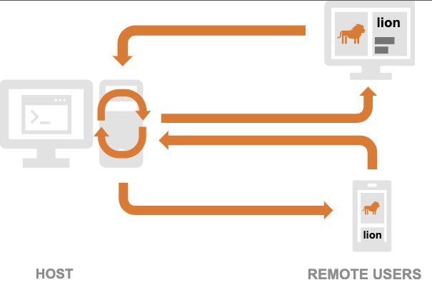

# Markdown 語法摘要
#### https://markdown.tw/
#### Markdown是一種輕量級標記式語言，創始人為約翰·格魯伯。它允許人們使用易讀易寫的純文字格式編寫文件，然後轉換成有效的XHTML文件。
#### Markdown的目標是實現「易讀易寫」。

## 標題

### Setext形式是用底線的形式，任何數量的=和-都可以有效果。

This is an H1 標題一
=============

This is an H2 標題二
-------------

### Atx形式則是在行首插入1到6個 # ，各對應到標題1到6階，例如：
# This is an H1 #

## This is an H2 ##

### This is an H3 ######

## 區塊引言

* Markdown使用email形式的區塊引言
 
> 這是區塊引言
> 這是第二行
> 第三行
> > 區塊引言可以有階層（例如：引言內的引言），只要根據層數加上不同數量的>

## 清單

> Markdown支援有序清單和無序清單。

> 無序清單使用星號、加號或是減號作為清單標記：

*   Red
+   Green
-   Blue

>有序清單則使用數字接著一個英文句點：(在清單標記上使用的數字並不會影響輸出的HTML結果)
3. 第一
2. 第二
5. 第三

>若使用**「階層式」的項目符號/編號**，只要記得空的格數要整齊即可。
+ 益者三友
  + 友直
  + 友諒
  + 友多聞
     + 益矣
+ 損者三友
  + 友便辟
  + 友善柔
  + 友便佞
     + 損矣

>要讓清單看起來更漂亮，你可以把內容用固定的縮排整理好：
*   Lorem ipsum dolor sit amet, consectetuer adipiscing elit.
    Aliquam hendrerit mi posuere lectus. Vestibulum enim wisi,
    viverra nec, fringilla in, laoreet vitae, risus.
*   Donec sit amet nisl. Aliquam semper ipsum sit amet velit.
    Suspendisse id sem consectetuer libero luctus adipiscing.

>清單項目可以包含多個段落，每個項目下的段落都必須縮排4個空白或是一個tab：
1.  This is a list item with two paragraphs. Lorem ipsum dolor
    sit amet, consectetuer adipiscing elit. Aliquam hendrerit
    mi posuere lectus.

    Vestibulum enim wisi, viverra nec, fringilla in, laoreet
    vitae, risus. Donec sit amet nisl. Aliquam semper ipsum
    sit amet velit.

2.  Suspendisse id sem consectetuer libero luctus adipiscing.

>如果要在清單項目內放進引言，那>就需要縮排：
*   A list item with a blockquote:

    > This is a blockquote
    > inside a list item.

## 代辦事項
>代辦事項的語法如下，若要在框框中打勾，則需在 [ ] 中輸入 x。
- [ ] 高鐵
- [x] 火車
- [x] 捷運
- [ ] 公車

## 程式碼區塊
>縮排4個空白或是1個tab就可以
This is a normal paragraph:

    This is a code block.
    
## 程式碼段落
Use the \`printf()\` function.

Use the `printf()` function.

>如果要放程式碼區塊的話，該區塊就需要縮排兩次，也就是8個空白或是兩個tab：
*   A list item with a code block:

        <code goes here>

## 分隔線
    * * *

    ***

    *****

    - - -

    ---------------------------------------
* * *

***

*****

- - -

---------------------------------------

## 表格
| Column 1 | Column 2 | Column 3 |
| -------- | -------- | -------- |
| Text1 | Text2 | Text3 |
| Text4    | Text5    | Text6    |

## 強調
    *single asterisks*
        _single underscores_
            **double asterisks**
                __double underscores__
*single asterisks*

_single underscores_

**double asterisks**

__double underscores__

## 圖片

\!\[Alt text](flow_sample_001.jpg "Optional title")

## 文字色彩

 *Blue Italic.* 

 Red HTML 

紅色

深藍色

## emojo
